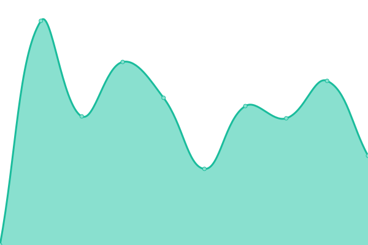

# [📈 Live Status](https://alteravitarp.github.io/upptime): <!--live status--> **🟧 Partial outage**

This repository contains the open-source uptime monitor and status page for [Altera Vita RP](https://discord.gg/alteravita), powered by [Upptime](https://github.com/upptime/upptime).

With [Upptime](https://upptime.js.org), you can get your own unlimited and free uptime monitor and status page, powered entirely by a GitHub repository. We use [Issues](https://github.com/alteravitarp/upptime/issues) as incident reports, [Actions](https://github.com/alteravitarp/upptime/actions) as uptime monitors, and [Pages](https://alteravitarp.github.io/upptime) for the status page.

<!--start: status pages-->
<!-- This summary is generated by Upptime (https://github.com/upptime/upptime) -->
<!-- Do not edit this manually, your changes will be overwritten -->
<!-- prettier-ignore -->
| URL | Status | History | Response Time | Uptime |
| --- | ------ | ------- | ------------- | ------ |
|  [Gitlab](https://git.r3ktm8.de) | 🟩 Up | [gitlab.yml](https://github.com/alteravitarp/upptime/commits/HEAD/history/gitlab.yml) | 

 936ms
     
 | 

<a href="https://alteravitarp.github.io/upptime/history/gitlab">100.00%</a>
    

|  [TxAdmin (Live)](https://txadmin.avoro.alteravitarp.de) | 🟩 Up | [tx-admin-live.yml](https://github.com/alteravitarp/upptime/commits/HEAD/history/tx-admin-live.yml) | 

 615ms
     
 | 

<a href="https://alteravitarp.github.io/upptime/history/tx-admin-live">100.00%</a>
    

|  [CopNET](https://gov.alteravitarp.de) | 🟥 Down | [cop-net.yml](https://github.com/alteravitarp/upptime/commits/HEAD/history/cop-net.yml) | 

 822ms
     
 | 

<a href="https://alteravitarp.github.io/upptime/history/cop-net">100.00%</a>
    

|  Proxmox Host | 🟩 Up | [proxmox-host.yml](https://github.com/alteravitarp/upptime/commits/HEAD/history/proxmox-host.yml) | 

 620ms
     
 | 

<a href="https://alteravitarp.github.io/upptime/history/proxmox-host">100.00%</a>
    

<!--end: status pages-->

[**Visit our status website →**](https://alteravitarp.github.io/upptime)

## 📄 License

- Powered by: [Upptime](https://github.com/upptime/upptime)
- Code: [MIT](./LICENSE) © [Anand Chowdhary](https://anandchowdhary.com), supported by [Pabio](https://pabio.com)
- Data in the `./history` directory: [Open Database License](https://opendatacommons.org/licenses/odbl/1-0/)
